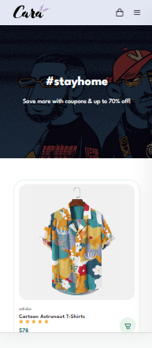
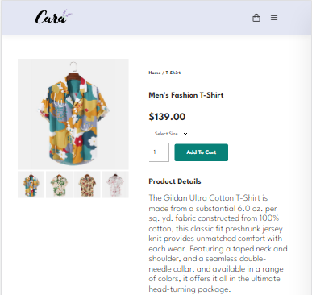

# Online Apparel Shop

### **Short Description**

---

This is a pet-project of online apparel shop. Website is built using mostly HTML, CSS. Designed in a modern way. Consists of several pages: main, shop, blog, about, contact, cart.

### **Design**

---

Design is fully responsive and looks nice on any device. Can be easily customized for any goals by changing titles, products, descriptions, images, color scheme. For example, you can see how it looks like on Iphone 12 pro below:

### **Main features**

---

Using Javascript was made a hideable sidebar menu for mobile phones which can be opened by clicking a menu button. Also a slider for product information page. In this slider one image is main and other are showed like previews. If you click on preview the corresponding image becomes main: 

## Check it here :point_down:

[E-COMMERCE WEBSITE](https://saveliy113.github.io/Online-Apparel-Shop/)
